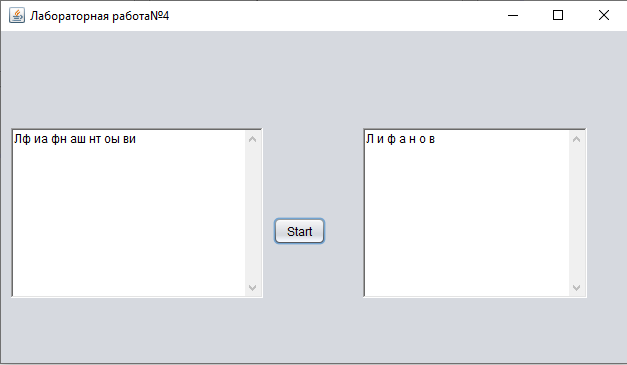

# Практика 4
| Фамилия, имя студента | Группа    | Дисциплина  |Тема                              
| --------------------- |:---------:| ------------|:--------------------------------:|
| Лифанов Евгений     | ИС-302    | СВП         |4.Работа со строками | 

Как выглядит визуально выглядит программа: 

